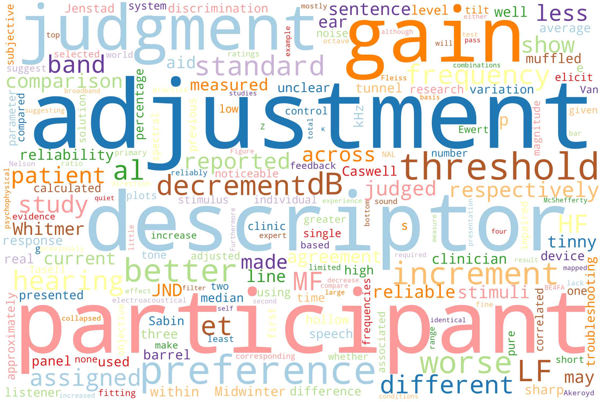

# wordcloud
## Python function to create word cloud image from .docx text

* Returns n most frequent words in a word document and plots word cloud
* n = n most frequent words in docfilename.docx in folder

